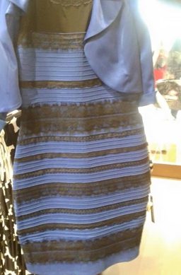

::: {.session-banner}
::: {.session-number}
Session 1 of 8
:::
::: {.session-title}
What Are We Bringing Into the Room?
:::
::: {.session-subtitle}
Connect · Create safety · Surface the lenses we're already looking through
:::
:::

## 🎧 Podcast Episode

::: {.audio-section}
::: {.audio-icon}
🎙️
:::
::: {.audio-info}
**Session 1 — The Church in the New Testament?**
*~30 min · Download and listen before or after your session*

[▶ Watch the Session 1 video on Facebook](https://www.facebook.com/watch/?v=804353785941860){target="_blank"}

*A conversation about how the church fits into the New Testament.*
:::
:::

## The Dress

{width=400px fig-align="center"}

*Source: [Wikipedia — The dress](https://en.wikipedia.org/wiki/The_dress){target="_blank"} · Photo originally by Cecilia Bleasdale · [CC BY-SA 4.0](https://creativecommons.org/licenses/by-sa/4.0/){target="_blank"}*

