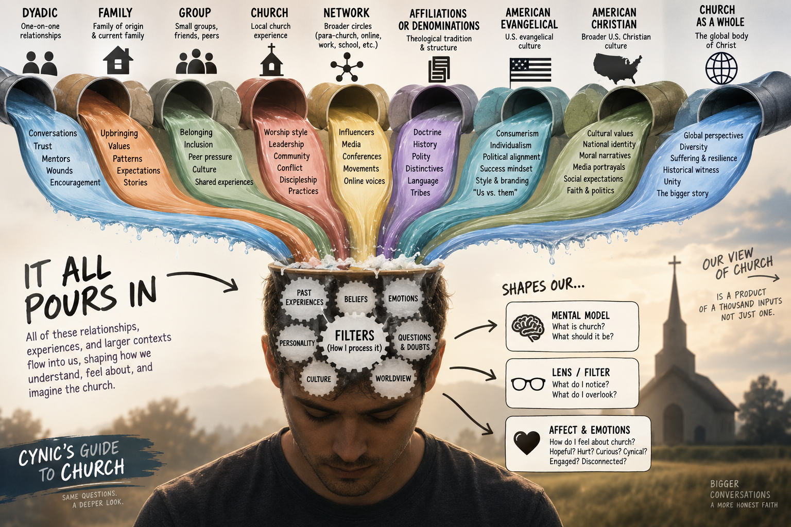
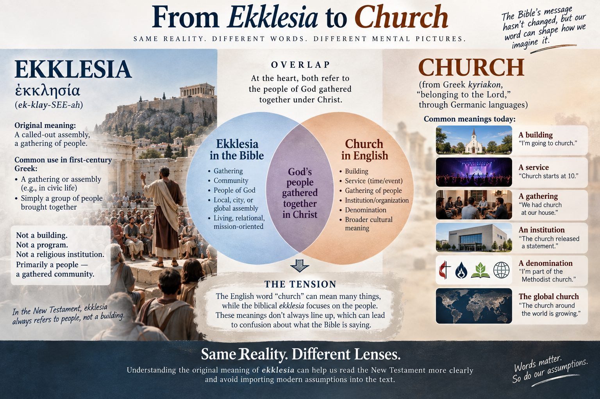

::: {.session-banner}
::: {.session-number}
Session 2 of 8
:::
::: {.session-title}
What Does "Church" Actually Mean?
:::
::: {.session-subtitle}
The word · The New Testament · The Temple connection · What got lost in translation
:::
:::

## Listen

::: {.audio-section}
::: {.audio-icon}
🎙️
:::
::: {.audio-info}
**Session 2 — What Does "Church" Actually Mean?**

[▶ Listen](#){target="_blank"}
:::
:::
---

## A reflection from last session

::: {.handout-section}
::: {.handout-title}
Looking back before we go forward
:::

{width=100% fig-align="center"}

*What experiences, relationships, or ways of thinking are most shaping the way you currently see or interact with the church?*

:::

---

## Before we get to anything else

Try this. Read each of these sentences and ask yourself what the word "church" is actually pointing to:

- "Where do you go to church?"
- "Church starts at 10."
- "We haven't been to church lately."
- "That church has great preaching."
- "We're looking for a church with a good youth program."

In the first sentence, "church" is a place. In the second, it's an event with a start time. In the third, it's a habit or practice. In the fourth, it's an organization with qualities. In the fifth, it's a service provider you might choose or not choose.

That's five different meanings in five sentences, and we use them all without thinking twice.

So when we say "the church hurt me" or "the church changed my life" -- what are we actually talking about? That question turns out to matter a lot. This session is an attempt to answer it carefully.

---

## The word itself

The Greek word behind our English "church" is **ekklesia** (ek-klay-SEE-ah). It's usually translated as church, assembly, or congregation.

Here is the first thing worth knowing: **this word was not invented by Christians.** In ordinary Greek, ekklesia referred to an assembly of people gathered together. That's all it meant. When a first-century Christian heard ekklesia, their mental picture was not a building with a sanctuary, pulpit, pews, staff, programs, and Sunday services. It was much closer to a people, an assembly, a gathered community.

The second thing worth knowing is that our English word "church" does not actually come from ekklesia at all. It comes through Germanic languages from a different Greek word, **kyriakon**, meaning "belonging to the Lord."

| Language | Word | Root |
|----------|------|------|
| English | church | kyriakon |
| Scottish | kirk | kyriakon |
| German | Kirche | kyriakon |
| English (academic) | ecclesiastical | ekklesia |

So when you read "the church at Corinth," the underlying word is not the ancestor of our English word "church." It is ekklesia, which just means assembly or congregation. That does not make "church" a bad translation because after centuries of Christian use, the word carries the communal meaning. But knowing the Greek history can correct some of the baggage we unconsciously attach to the English.

---

## Ekklesia before Christianity

The word has a history that predates Jesus entirely. It appears throughout the Greek Old Testament, the Septuagint, where it often translates the Hebrew word **qahal**, meaning an assembly or congregation.

Deuteronomy 9:10 refers to Israel assembled before God: "on the day of the assembly." The Greek there uses ekklesia. Deuteronomy 23 repeatedly speaks of entering the "assembly of the LORD" -- again using ekklesia in the Greek translation.

So there were really two backgrounds informing how first-century Christians would have heard this word. From the Greek and Roman world, it suggested an assembly of citizens or people. From the Jewish and Old Testament world, it evoked the assembled congregation of God's people. That combination becomes important as we move through the New Testament.

---

## Jesus uses the word

Ekklesia is strikingly rare in the Gospels. It appears only in Matthew, and only twice.

**Matthew 16:18**

> "I will build my church..."

In Greek: oikodomeso mou ten ekklesian.

Jesus does not say "I will build my religious institutions." The object being built is his ekklesia, his people, his assembly. And notice the possessive -- "my church." The church belongs to Christ. That is already a significant claim.

**Matthew 18:17**

> "Tell it to the church..."

Here ekklesia is more concrete. This is not simply the universal body of all Christians. It is a recognizable community of believers who are capable of hearing a dispute and responding to it. A specific group of people who know each other.

This gives us a tension worth sitting with. The church is both a theological reality and an actual community of actual people. Both are true in the New Testament at the same time.

---

## Acts shows us something fascinating

Acts provides one of the clearest demonstrations that ekklesia did not inherently mean "Christian church." Look at what happens in Acts 19, during the riot in Ephesus.

Acts 19:32: "The assembly was in confusion..."

Acts 19:39: The city clerk says the matter should be settled "in a legal assembly."

Acts 19:41: "After he had said this, he dismissed the assembly."

The word Luke uses in all three of those verses is **ekklesia**. This is a pagan mob and an official civic gathering. Luke is obviously not saying "the church was in confusion." He is saying the assembly was in confusion. The context determines what kind of assembly is being described.

Earlier in Acts, Stephen refers to Israel gathered in the wilderness as an ekklesia (Acts 7:38). So the same word can describe Israel in the Old Testament, a pagan mob, a civic assembly, and the community of Jesus followers -- all depending on context.

---

## Then Christianity fills the word with new meaning

Once Acts begins describing the community formed around Jesus, ekklesia appears constantly.

Acts 5:11 -- "Great fear seized the whole church..."

Acts 8:1 -- "...a great persecution broke out against the church in Jerusalem..."

Acts 8:3 -- "Saul began to destroy the church."

That last one deserves a second look. Saul was not destroying buildings. He was entering houses and dragging believers away. So what was "the church" that Saul was attacking? **People.** That is what the church is.

---

## The different scales of ekklesia

One of the most revealing things about the New Testament's use of ekklesia is the range of scales it covers.

**The church in a particular city**

This is extremely common. "The church in Jerusalem" (Acts 11:22). "The church of God in Corinth" (1 Corinthians 1:2). "The church of the Thessalonians" (1 Thessalonians 1:1). "The church in Cenchreae" where Phoebe served (Romans 16:1).

Notice that Paul does not write "To Corinth Community Church." He writes to God's ekklesia that is in Corinth. That is a subtly different thing -- the church does not belong to the city. It belongs to God and happens to be located there.

**The church in someone's house**

This may be even more revealing. Romans 16:5: "Greet also the church that meets at their house." 1 Corinthians 16:19: Aquila and Priscilla have "the church that meets at their house." Colossians 4:15: "Nympha and the church in her house." Philemon 2: "the church that meets in your home."

Ekklesia can describe a specific gathering of Christians meeting in a house. So we already have multiple scales -- house, city, larger people of God -- and all of them can be called ekklesia.

**The church as a gathered meeting**

1 Corinthians 11:18 -- "When you come together as a church..."

That is fascinating language. Paul can distinguish between the people and the act of their coming together as an ekklesia. 1 Corinthians 14:23: "So if the whole church comes together..." The church **actually gathers**. Ekklesia is not merely an abstract spiritual identity. It is a people who assemble together and do things together.

**The church as the entire people of Christ**

Paul also stretches the concept far beyond any one local gathering. Ephesians 1:22-23: God appointed Christ "to be head over everything for the church, which is his body." Ephesians 5:25: "Christ loved the church and gave himself up for her." Colossians 1:18: Christ "is the head of the body, the church."

Here ekklesia is not one house church or the Christians in one city. It is Christ's people collectively -- people joined to Christ and therefore joined to one another.

---

## Putting it together

| Use of Ekklesia | Example | What it means |
|-----------------|---------|---------------|
| Ordinary assembly | Acts 19:32 | A gathered crowd |
| Civic assembly | Acts 19:39 | Official public assembly |
| Israel's assembly | Acts 7:38 | God's Old Testament people assembled |
| House church | Romans 16:5 | Believers meeting in a home |
| City church | 1 Corinthians 1:2 | Christians in Corinth |
| Gathered meeting | 1 Corinthians 11:18 | Christians actually assembled |
| Universal church | Ephesians 1:22-23 | The whole body of Christ |

This range helps prevent two opposite mistakes.

One is "church just means the universal body of believers, so gathering is not really important." The New Testament does not support that. Ekklesia frequently describes actual communities that actually gather.

The other is "the church is basically the Sunday service or the organization that runs it." The New Testament does not support that either.

The ekklesia is fundamentally **the people.**

---

## One popular explanation that does not quite work

You have probably heard something like this: "Ekklesia comes from *ek*, meaning 'out of,' and *kaleo*, meaning 'to call,' so the church literally means the called-out ones."

This is worth examining carefully, because it sounds compelling and gets repeated constantly.

The problem is Acts 19. The pagan mob rioting in Ephesus is called an ekklesia. Luke is not suggesting that the Ephesian rioters are spiritually called-out ones. By the New Testament period, the word simply meant assembly. Words mean what speakers use them to mean, not just the sum of their historical roots.

There is nothing wrong with saying that God has called his people, or that Christians are called out of darkness -- 1 Peter 2:9 says exactly that. Those are true and important things. But the Greek word ekklesia does not actually establish them. That is mixing a valid theological idea with a shaky lexical argument, and it is worth knowing the difference.

---

## The problem with language

::: {.handout-section}
::: {.handout-title}
Words can be confusing
:::

{width=100% fig-align="center"}

*How do you define church?*

:::

---

## The Temple connection

There is a bigger theological picture here that changes how we think about all of this.

The progression from Old Testament to New Testament is not primarily:

**Old Testament religious building -> New Testament religious building.**

It is something far more radical:

**God dwells among Israel -> God dwells uniquely in Christ -> God's Spirit dwells in his people -> those people become God's temple, body, and household.**

Under the old covenant, God's presence was associated with a place. There were concentric boundaries: nations, then Israel, then priests, then the high priest, then the Holy of Holies. And at the center was the curtain.

That architecture communicated something almost physically: God is holy, humanity is estranged, and access is restricted.

Then Matthew records what happens at the moment of Jesus' death:

> "The curtain of the temple was torn in two from top to bottom." (Matthew 27:51)

That is not just a dramatic supernatural event. Hebrews makes the meaning explicit: believers now have confidence to enter God's presence directly, by the blood of Jesus (Hebrews 10:19-22).

So Christianity does not build another Holy of Holies. Instead, Paul tells the Corinthians:

> "You yourselves are God's temple and God's Spirit dwells in you." (1 Corinthians 3:16)

And Peter describes Christians as "living stones" being built into a "spiritual house" (1 Peter 2:5). Ephesians 2:19-22 says believers are "being built together to become a dwelling in which God lives by his Spirit."

**The people become the building.** That is the shift. God no longer primarily dwells among his people in a sacred structure. He dwells in his people by the Spirit.

The New Testament has four overlapping images for what the church is, and all of them point to this:

| Image | Greek | Key text | What it communicates |
|-------|-------|----------|----------------------|
| Assembly | ekklesia | Matthew 16:18 | A gathered people belonging to Christ |
| Body of Christ | soma Christou | Ephesians 1:22-23 | Joined to Christ, joined to each other |
| Temple of God | naos theou | 1 Corinthians 3:16 | God's Spirit dwells in his people |
| Household of God | oikos theou | Ephesians 2:19 | Family, belonging, shared life |

---

## From restricted access to something radical

The Temple was built around distinctions in access. Priests had access others did not. The high priest had access priests did not. Gentiles had less access than Jews. The Holy of Holies was essentially inaccessible to everyone except the high priest, once a year.

The gospel reverses that entire architecture.

Peter takes language that had been associated with Israel and the priesthood and applies it to the whole Christian community: "You are a chosen race, a royal priesthood, a holy nation" (1 Peter 2:9). That does not mean the New Testament church has no leaders -- it clearly does. But leadership is no longer a priestly class that mediates God's presence to ordinary believers. There is one mediator: Christ (1 Timothy 2:5).

This is why the early Christian gathering looked surprisingly simple compared to the Temple. There was no altar with priests performing sacrifices, because the sacrifice had already been offered. There was no Holy of Holies, because access had been opened. There was no sacred priestly caste, because the whole people of God are priestly. There was no geographical center toward which everyone must pilgrimage, because Christ is present with his gathered people.

The structure reflects the gospel.

---

## The biblical arc

You can trace the whole story as a single line:

| Stage | What it means |
|-------|---------------|
| Eden | God with humanity |
| Tabernacle | God dwelling among Israel |
| Temple | God's localized covenant presence |
| Jesus | "The Word became flesh and dwelt among us" |
| Church | God's Spirit dwelling in his people |
| New Creation | "The dwelling place of God is with man" (Revelation 21:3) |

The church occupies an intermediate place in this story -- between the cross and the return of Christ. We do not yet experience God's presence as we will in the new creation. But neither are we standing on the other side of the curtain waiting for access. The Spirit has been given. Something genuinely new has happened.

---

## What this means for us

If all of that is right, then the way the church exists is supposed to communicate the gospel -- not just the words it speaks.

A church can verbally proclaim the priesthood of all believers while structurally making Christians into spectators. It can proclaim that God dwells in his people while functionally treating a building as the locus of God's activity. It can proclaim reconciliation while organizing itself around demographic similarity. It can proclaim servanthood while creating celebrity leaders.

None of those contradictions are necessarily intentional. But they are worth noticing. The question is not only what our church says. It is what our church's structure appears to say.

---

## Questions worth sitting with

1. When you picture "the church," what do you picture? Does anything we talked about change that?

2. On average, does the American Church structure demonstrate the Gospel?

3. How does it and how does it not?

4. Ephesians 2 says the church is supposed to embody reconciliation between people who were previously divided. Where have you seen that happen? Where have you seen churches reinforce those divisions instead?

---

## Reflection

**One thing from tonight that surprised me or landed differently than I expected:**

_______________________________________________

_______________________________________________

**A question this raised:**

_______________________________________________

_______________________________________________

**The question to carry into Session 2:**

> What do you expect to happen in church? What is shaping those expectations? Where did they come from?

Just another reflection, you will not have to answer out loud (but you can)